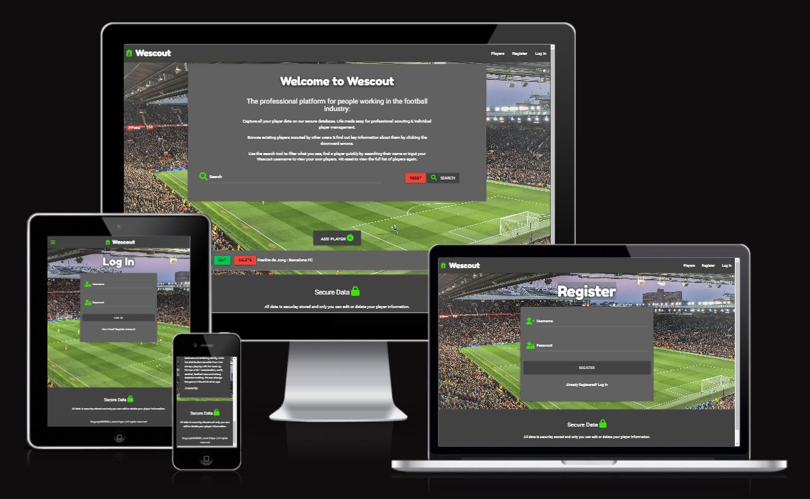

<h1 align="center">Wescout</h1>

## About

***

[Wescout](https://github.com/JackDilger/wescout-milestone-3)  is player managment database built for professionals working in the Football industry. Users of the site can discover new talent by browsing and searching for existing players and learn key information, such as market value or read more in depth player analysis from other users. This app has a clean and itutitive interface which allows users to easily maintain player information, users can securely add,edit and delete player data once they register for an account. 

## Strategy and planning

***
