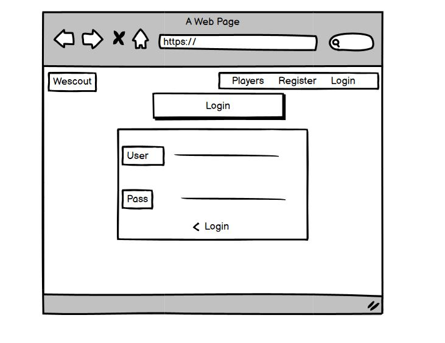
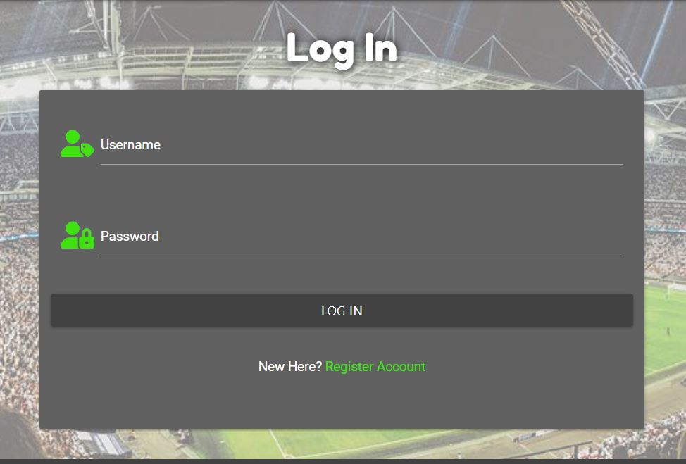
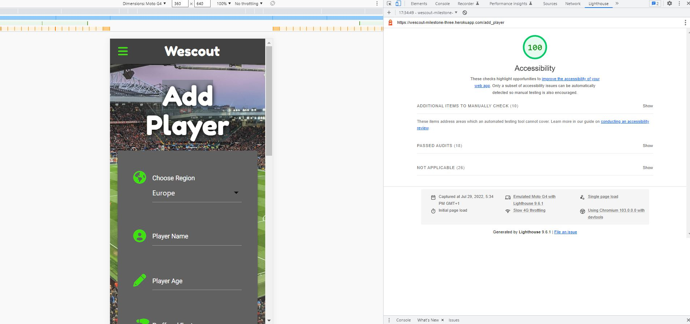

<h1 align="center">Wescout</h1>

## About

***

[Wescout](https://github.com/JackDilger/wescout-milestone-3)  is player management database built for professionals working in the Football industry. Users of the site can discover new talent by browsing and searching for existing players and learn key information, such as market value or read more in-depth player analysis from other users. This app has a clean and intuitive interface which allows users to easily maintain player information, users can securely add, edit, and delete player data once they register for an account. 

## Strategy and planning

***

Why football?

Football is the most popular sport in the world, with an estimated following of 4 billion fans. It is a global sport played by hundreds of millions of people around the world. It's a game that breaks down social boundaries like no other sport and is inclusive
to everyone, connecting people of opposite cultures. The UK Sports Industry alone is worth £23.8 billion and holds nearly 1 million jobs, none more important than scouts. The biggest clubs have worldwide scouting networks and some full-time scouts can work up to 80 hours a week, watching many games in many different countries. With such a vast amount of data, it is crucial that you have somewhere to securely maintain information on your players.

The Wescout app aims to be a hub for football scouts and professionals working in the industry, whereby they can safely store player information and capture key data about them all in one place. Player information is always changing, whether they are moving clubs or their market value is fluctuating due to performance. This is why it is important you can update this information easily or delete records of players you are no longer monitoring. The Wesout app allows users to seamlessly manage all player data in this way with the ability to add, edit and delete player information on the go at any time on any device. 

It's normal to be maintaining information on hundreds of players at a time as a football scout, therefore it is vital to be able to quickly locate player information without spending hours scrawling through lists of information. The Wescout app has an intuitively designed search index, you can find an individual player instantly by searching their name or filter the database to only display your own added players. 

We want to build a community of people in the football industry and develop the site in this direction of a collaborative approach towards scouting. Discovering fresh talent can be challenging and costly and we wanted to offer a solution to this. That is why we wanted users to be able to collaborate by sharing player data. As well being able to maintain your own information you can browse the full list of players added by other Wescout professionals. 

One of our main aims with doing this, was to ensure though that your own information was kept secure. We understand the important of safely managing data online, which is why we used a multitude of defensive programming features in the app to ensure your information is safe.

## User Experience (UX)

-   ### User stories

    1. As a user, I want to understand the purpose of the website immediately upon opening the site.
    2. As a user, I want to be able to easily navigate the website. 
    3. As a user, I want to be able to quickly register a profile and be given confirmation of this action.
    4. As a user, I want to easily log out and be given confirmation of this action.
    5. As a user, I want to easily log in to my registered profile anytime I return and be given confirmation of this action.
    6. As a user, I want to easily add new players and be given confirmation of this action.
    7. As a user, I want to easily edit my player information and be given confirmation of this action.
    8. As a user, I want to easily delete my player information and be given confirmation of this action.
    9. As a user, I want to be able to view all players added to the database.
    10. As a user, I want to be able to search for an individual player by name.
    11. As a user, I want to be able to view only players I have added to the database.
    12. As a user, I want to be able to reset the player view after using searches.

-   ### Site Developer/Owner

    1. As the site developer/owner, I want to encourage the user to use the website as much as possible to grow the player base, I'll do this by offering future development that will benefit users to stay innovative.
    2. As the site developer/owner, I want to be the only user with access to edit/add/delete scouting regions.
    3. As the site developer/owner, I want to be able to add new scouting regions and be given confirmation of this action.
    4. As the site developer/owner, I want to be able to edit scouting regions and be given confirmation of this action.
    5. As the site developer/owner, I want to be able to delete scouting regions and be given confirmation of this action.
    6. As the site developer/owner, I only want users to have access to add players once they are registered and logged on.

## Layout

***

- I used Balsamiq to structure the layout of my website during the initial design phase.
- I used Materializes built in grid system to make my site responsive across all devices.

### Home page (players) wireframe

### Add Player wireframe

### Edit Player wireframe

### Add Region wireframe

### View Regions wireframe

### Login wireframe

### Register wireframe

### Profile wireframe

## Existing Features and how they align to user stories

***

- __Logo-Links to user story 1 & 2__

  - The head of the page contains the 'Wescout' logo. The logo was designed to represent the websites target audience and purpose.
  - The text content of the logo 'Wescout', offers an indication to the user what the site offers and who it is built for. The player ID icon also lends to this by showing it is a place for player information.
  - The logo also serves as a clickable link, allowing users a straightforward way to navigate back to the home page at any time. The logo is consistently situated on each page of the website because of this.

- __Welcome Page- Links to user story 1__
  - The welcome page displays as soon as you load the website, it offers clear text content abouts its purpose and target audience and gives helpful tips on how to use the websites features.

  

  
- __Search Bar- Links to user story 10, 11 & 12__
  - The search bar has a text index which searched the players database in MongoDB, it allows users to find individual players by name or view only players the user has added themselves. 
  - The reset button will allow you to reset the player view once you have finished with your search

  

- __Player Collapsible- Links to user story 8__
  - The player collapsible shows a full list of all players added to the Wescout database.
  - You can see quick key information about the players name and club, and you can also expand each player section to view all the player data.

  

- __Register- Links to user story 2 & 3- Links to site owner goal 6__
  - Users can easily navigate to the register page using the nav bar link
  - In this screenshot you can see the flash message 'You must register to add players', which is triggered if a player
  tries to use the add player button without being signed in. 
  - Users can easily register here by filling out the required input fields on the form.
  - Once registered you are taking to the profile page and welcomed to the site to give confirmation of your registration.

  

- __Log in- Links to user story 2 & 5__
  - Users can easily navigate to the register page using the nav bar link
  - Users can easily log in here by filling out the required input fields on the form.
  - Once logged you are taking to the profile page and welcomed to the site to give confirmation of your login.

  

- __Log Out- Links to user story 2 & 4__
  - Users can easily log out but using the nav bar link
  - Once logged out they will be taken to the log in page and a flash message will confirm they have successfully logged out.

  

- __User Profile- Links to user story 3 & 5- Links to site owner goal 1__
  - Anytime a user logs in or registers, they will be taken to their profile page and a flash message welcoming them gives confirmation they are logged in.

  - Another important reason they are taken here when logging in, is that here the site developer/owner keeps users up to date on future development and features users can look forward to. 

  

- __Add Players-Links to user story 2 & 6__
  - Users can easily navigate to the add players form using the nav bar link once logged in, or using the add player button from the players page.
  - The add player form is easily completed by filling out all required input fields and is clear on what information is needed. 
  - Once the form is submitted, they are taken to the players page where a flash message will confirm their player has been added successfully. 

  

- __Edit Players- Links to user story 2 & 7__
  - Users can easily edit their added player information by using the edit button which takes them to the form. The form will have the preloaded player information and allow them to easily update any fields before submitting the new player data. 
  - Once the form is submitted, they are taken to the players page where a flash message will confirm their player has been updated successfully. 

  
  

- __Delete Player- Links to user story 2 & 8__
  - Users can easily delete their added players by using the delete button. The Button will open a modal to confirm the deletion or give the option to cancel the request.
  - Once they confirm deletion on the modal pop up, they are taken to the players page where a flash message will confirm their player has been successfully deleted. 

  

- __Manage Scouting Regions- Links to site owner goal 2__
  - The Regions page is hidden to all users except the admin.
  - Once logged in the admin user can easily navigate to the regions page using the nav bar link that will appear only to them
  - The regions page allows the admin to easily add/edit/delete regions using the required buttons.

  

- __Add Region- Links to site owner goal 3__
  - The admin can easily add new regions by using the add region button which takes them to the form. The form is easily completed  by filling in the required input field.
  - Once the form is submitted, they are taken to the regions page where a flash message will confirm their region has been added successfully. 

  

- __Edit Region- Links to site owner goal 4__
  - The admin can easily edit regions by using the edit button which takes them to the form. The form will have the preloaded region name and allow them to easily update this by filling in the required input field.
  - Once the form is submitted, they are taken to the regions page where a flash message will confirm their region has been updated successfully.  

  

- __Delete Region- Links to site owner goal 5__
  - The admin can easily delete a region by using the delete button. The Button will open a modal to confirm the deletion or give the option to cancel the request.
  - Once they confirm deletion on the modal pop up, they are then taken to the regions page where a flash message will confirm the region has been successfully deleted. 

  

## Data Schema

***

The above image shows the information being stored across the 2 databases and the links between the 2. I chose to use both a relational and non-relational database in the Wescout app, with both linking together where appropriate. Each database stores the information that is relevant to its strengths.

I used relational database with POSTGRESQL and SQLALCHEMY for user authentication data and my list of scouting regions. The reason being that this is structured information that is unlikely to change, which lends itself to the strengths of this type of database. The user and region data is stored in rows and columns in a structured manner and data that can be changed is stored only on one location. 

I used a non-relational database with MONGODB for the player information. The reason being that all player details are vastly different which lends itself perfectly to this type of database; with its main strength of storing unstructured document-based information.

The unique region ID is inputted into each player document linking the 2 databases together. This ensures if a region is to be deleted, all players from that region would be removed from the database as well. This helps to ensure there is no redundant information being stored in MONGODB. This cascade delete function is a powerful feature so it is restricted so that only the website admin can have control over it.

The username for each registered user is store into each player document. This is super important, as this allows the app to know who each player was 'created by' and use defensive programming to ensure only a user themselves can edit/delete their saved player data.

## Defensive programming features

***

Security was focused on throughout the app to ensure player data was handled in a safe manor, a number of defensive features were
built into the design:

- The 'Add Player' button on the main home page will run a check to see a user is in session and redirect them to register/login if not. It's important players are logged in to their user profiles before being able to add players so we know who players were 'created by'. 
- The edit and delete buttons both run checks to see who the listed players were 'created by', this ensures that any user in session will only be permitted to edit or delete players they have added to the database. They cannot edit or delete players added by other users. 
- If a delete button is clicked, instead of deleting the chosen information instantly a modal is launched which offers the user the choice to either proceed or cancel the request. 
- We’ve used Werkzeug to hash passwords for each user when registering to site. This adds an additional layer of security by allowing the data to be stored in a format that can't be reversed at any reasonable amount of time or cost for a hacker.
- Only once a user registers to the site will they be given access to the add player and profile pages. These nav bar links are
hidden until a user is in session. 
- The scouting regions page is only visible to the website admin when logged. This nav bar link his hidden to all other users. The functions for adding/deleting/editing regions all run checks to ensure only the admin user can carry out these actions. 

### Testing 

***

### Validator Testing 

- [Js Hint](https://jshint.com/)- All individual JavaScript files were copied into JS hints validator and no warnings were found.
- [WC3 Mark Up Validation](https://validator.w3.org/)- The published site link was validated and returned no error or warning in my HTML.
- [W3C CSS Validation](https://validator.w3.org/)- The published site link was validated and returned no error or warning in my CSS.
- [PEP8 online](http://pep8online.com/)- Was used to validate all python code and was fully pep8 compliant. 

## Development Version- Manual Testing

Test            | Outcome                          | Result
--------------- | -------------------------------- | ------------
Wescout logo | When the logo is selected with a click does it link back to the home page or refresh the home page if the user is already there? | Pass 
Nav bar links | Do all nav bar links direct the user to the intended destination? Does the text underline when hovering over to indicate the link is clickable?| Pass 
Button Links | Does each link direct the user to the intended destination? Does the border change colour when hovering to indicate the button is clickable? | Pass
Responsiveness | Is the website responsive across all devices? | Pass
Accessibility | Is the website accessible for all users? | Pass
Flash Messages | Do flash messages display to confirm all user actions for add/edit/delete/login/logout? | Pass
Add player Button | Does the add player button load the add player form if a user is logged in? Does it redirect to the register page if not? | Pass
Search bar | Does the search bar enable text index search using player name or username? | Pass
Reset Button | Does the reset button reload all players after using searches? | Pass
Player Collapsible | Does the player collapsible show all players currently on the database? Does it expand on click and display all player information? | Pass
Edit player button | Does the edit player button open the edit player form? Does it only allow the user who added the player to request this? | Pass
Delete player button| Does the delete player button load the modal for confirmation of deletion? Does it only allow the user who added the player to confirm this? | Pass
Register | As a new user can I easily register to the site using the form? | Pass
Profile | As a user am I taken to the profile page when I register to welcome me? Can I see future features in development on this page? | Pass
Log out | Can I use the navbar link to log out?  | Pass
Log in | Can I log back into the site easily using the log in form? | Pass
Add player form | Does the add player form allow me to add a new player to the database? | Pass
Edit player form | Does the edit player form allow me to update my players information? Does the current information of the player preload on to the form? | Pass
Regions page | Is the scouting regions page hidden to all users apart from the admin of the website? | Pass
Add Region | Can only the admin user launch the add region form? Does the add region form allow the admin user to add a new region? | Pass
Edit Region | Can only the admin user launch the edit region form? Does the edit region form allow the admin user to update a region name? | Pass
Delete Region | Does the delete region button open the deletion confirmation modal? Can only the admin user confirm deletion?
Does deleting a region cascade delete all players part of that region? | Pass
404 error page | Is a user taken to the 404-error page and provided with a working link back to the main site if they are directed to a non-existent page? | Pass

## Deployed Version- Manual Testing

Test            | Outcome                          | Result
--------------- | -------------------------------- | ------------
Full checks against development version | Were all development testing criteria still passed once the site was deployed, with no errors showing? | Pass
Visual Checks | Are all images of usable resolution, all text unobscured and undistracted foregrounds? | Pass
Code checked | No errors showing in the code? | Pass
Console errors | No console errors showing? | Pass

### Accessibility

I have used the chrome developer tool extension ‘Lighthouse’ to evaluate my sites accessibility. To provide a good user experience lighthouse recommends sites should strive to have a good score (90-100). All pages on the site have a 100% score in lighthouse.

### Browser Testing

- I tested the site across multiple browsers which all worked.
  - Chrome
  - Safari
  - Edge
  - Firefox
  - Opera

### Device Testing

- I manually tested the site across different device operating systems which all worked.
  - The latest version of iOS and iPadOS  is 15.5.
  - The latest version of Android OS 12
  - Windows PC
  - MacBook

- I used chrome dev tools to manually test the sites responsiveness across a range of devices which all worked. Devices include:
  - iphone 5-12
  - iphone SE
  - iphone XR
  - iphone 12 PRO
  - Pixel 5
  - Galaxy S8+
  - Galaxy S20 Ultra
  - Galaxy A51/71
  - Galaxy Fold
  - ipad Air
  - ipad Mini
  - Surface Pro 7
  - Surface Pro Duo
  - Windows PC
  - MacBook
  - Nest Hub
  - Nest Hub Max

- The site was run through [Am I Responsive?](https://ui.dev/amiresponsive) to visually show the fully responsive layout which again can be seem below:
 

## Technologies used

***

### Languages & Frameworks

- [HTML5](https://en.wikipedia.org/wiki/HTML5)- Markup language.
- [CSS3](https://en.wikipedia.org/wiki/CSS)- Style sheet language.
- [JavaScript](https://en.wikipedia.org/wiki/JavaScript)-  Programming language used to add interactivity to the homepage and implement the logic required to make the app work.
- [Python](https://en.wikipedia.org/wiki/JavaScript)- Backend language used to control the logic on the site.
- [Flask](https://en.wikipedia.org/wiki/JavaScript)-  Python framework used to simplify the routing and HTML templating on the site using jinja.
- [MongoDB](https://en.wikipedia.org/wiki/JavaScript)- Non-Relational Database.
- [POSTGRESQL with SQLALCHEMY](https://en.wikipedia.org/wiki/JavaScript)- Relational Database.
- [Materialize](https://en.wikipedia.org/wiki/JavaScript)- Scripting language.
-

### Additional Tools 

***

- [Balsamiq](https://balsamiq.com/)- Used to build wireframes.
- [Google Fonts](https://fonts.google.com/)- Sourced the website fonts.
- [Chrome Dev Tools](https://developer.chrome.com/docs/devtools/)- Used to troubleshoot problems with code.
- [Convertio](https://convertio.co/jpg-avif/)- To change image file type.
- [Favicon.io](https://favicon.io/emoji-favicons/question-mark/)- Sourced the website Favicon.
- [Unsplash](https://unsplash.com/photos/1fZC2rYbpsU)- Sourced background image.
- [Gitpod](https://gitpod.io/workspaces)- Integrated development environment (IDE)  Used to write all my code.
- [Git](https://git-scm.com/)- Used for version control.
- [Github](https://github.com/)- Used to host my repository.
- [Beautifier](https://beautifier.io/)- Used to organise code consistently.
- [Font Awesome](https://fontawesome.com/) Large database of icons which I used all over the site to add to the visual language.

### Future development

***

This is very much version one of the website and there are many features I would like to develop and apply in future to help further improve it:

- I will be adding a 'My Watchlist' Feature to the user profile page. These will allow users to manage their favourite players on configurable lists and keep them organised to make player analysis easier. This will involve adding a like button next to the edit and delete button on the player collapsible. Only users logged in and registered to their account will be able to make use of this feature. The function behind this will render a list of the users liked players in their 'Watchlist' on the profile page. This would mean remodelling my data schema so the database can keep track of users liked players. I think this will be a great feature for our target audience, it will allow them to quickly find a full list of their favourite players making it easier to keep track of players of interest. 
- I would really like to implement a direct chat feature on the website, this would really benefit our users by allowing them to create contacts with likeminded professionals in the industry. This would help build the Wescout community and push towards a collaborative approach towards scouting as intended in our initial planning stage. This feature would take longer to implement as it would mean using technologies I am not yet familiar with. After some research I think the best way of doing this would be to implement a already built chat API like this one found on [getstream.io](https://getstream.io/chat/?utm_source={google}&utm_medium={cpc}&utm_campaign=GOO|S|NB|ROW|ALL-EN|Core%26utm_adgroup=Chat%26utm_custom%3D15846636712%26utm_content%3D574272573811%26utm_term%3Dchat%20service%20for%20website%26matchtype=p%26device=c%26location=1006912&_bt=574272573811&_bk=chat%20service%20for%20website&_bm=p&_bn=g&gclid=CjwKCAjwwdWVBhA4EiwAjcYJEOvwfDTFmJDPf7ozzz5N-w0hQGt3_YgY8GVSEiLWaT0_pG8K3H6e1xoCWFMQAvD_BwE). 
- I would also like users to have the ability to document match reports on players saved to their watchlist. This would really take the player analysis to the next level and would be a key feature in growing the user base. Player performance in game is what matters the most when scouting players, and it would be an essential feature to be able to keep track of players performance. This would really help in meeting our target audiences need for this. I would use a form input which would allow a select field with a list of your watch listed players and allow free form text input to keep track match statistics. These types of reports would be unstructured data that could easily be stored in my non-relational database in MONGODB. 

### Known bugs and Fixed bugs during development

- The site has been fully tested and there are no known bugs.

Here is a list of notable bugs during development: 
    
- The select dropdown field for regions on the add player form was not working- After looking through the code I found that I had not initialized the component with necessary JavaScript. Once this was added this bug was fixed. 
- When adding a new player using the add player form, the player information was not being posted to my 'Players' collection which I had already created. Instead, the document was being inserted into a new collection that was automatically created called 'Player'. The fault found here was a simple spelling mistake in the add player function which was fixed by adding the plural players not player to the insert document line. 
- When testing the site to ensure user feedback was showing for each action, I could see no feedback was showing for any action taken in the regions page by the admin user. The flash message was set up in the function, but I was not returning the correct template where the flash message was being displayed. Changing this was simple by updating the URL for link to display the correct page where the flash message was shown. 

## Deployment

This app was deployed very early on during development to Heroku and linked to GitHub so that changes made to the development environment would update on the live site as soon as they were pushed from Gitpod.

Deployment was carried out as follows:

1. Open project in Gitpod and run the command *pip3 freeze --local > requirements.txt* - this creates a txt file that Heroku reads to check which dependencies are in use on the site.
2. Create a Procfile manually or by running the command *echo web: python run.py > Procfile* ('run.py' should be whatever the main python file is called). **Remove any blank line from the bottom of the new Procfile and ensure these changes are pushed to Github before proceeding.**
3. Log in (or create an account) on [Heroku](https://www.heroku.com/), select 'Create new app', fill out the name (dashes instead of spaces) of your app, your closest region, and finally click 'Create app'.
4. Navigate to the 'Deploy' tab on the dashboard and select Github, then search for your repository and click 'connect'.
5. Navigate to the 'Settings' tab, click 'Reveal Config Vars', and fill them out as follows:

| Key         | Value
| -----------  | ---------- 
| IP           | 0.0.0.0
| MONGO_DBNAME | *my_mongodb_name*
| MONGO_URI	   | mongodb+srv://root:<*password*>@cluster0.sgi7e.mongodb.net/<*database_name*>?retryWrites=true&w=majority
| PORT         | 5000
| SECRET_KEY   | *my_secret_key*
| DATABASE_URL | *postgresql URL*

6. Return to the 'Deploy' tab and select 'Enable Automatic Deploys', ensuring that the master branch is selected.
7. Click 'Deploy Branch' and wait for Heroku to build the app. You can monitor the progress in the 'Latest Activity' of the overview.
8. Once the build has been completed, click 'Open app' to check that the live site is working.

## Cloning

To clone this project, follow these steps:

1. Navigate to the main page of the repository.
2. Click on the 'Code' dropdown and copy the command present on 'GitHub CLI'.
3. Paste the command into the terminal on your IDE.
4. Install the dependencies present in *requirements.txt* by running *pip3 install -r requirements.txt* in the terminal.
5. Create a MongoDB database that includes the collections displayed in the above schema (or whatever specification you require for this clone).
6. Create an environment python file and include the following:
   * os.environ.setdefault("IP", "0.0.0.0")
   * os.environ.setdefault("PORT", "5000")
   * os.environ.setdefault("SECRET_KEY", "[SECRET KEY]")
   * os.environ.setdefault("MONGO_URI", "[MONGO URI"])
   * os.environ.setdefault("MONGO_DBNAME", "[YOUR DB NAME]")
   * os.environ.setdefault("DB_URL", "postgresURL")

*You will need to create your own secret key and get the uri and URL code from MongoDb* 

7. At this stage you should be able to launch the preview by running 'python3 app.py' in the terminal.

*Note - make sure to include your env.py file in the .gitignore file so that no sensitive information is pushed to GitHub.

## Credits

### Media

- The background image present on the base.html template was taken from [unsplash](https://unsplash.com/photos/7NhFrPxlgM8)

### Acknowledgements

- Brian from Code institute for taking us through 3 masterclasses to get more in depth understanding of relational and non-relational databases and how to combine the 2. 